# SEO Competitive Intelligence & Analysis Engine - Architecture

## Overview

This project implements a sophisticated multi-agent SEO competitive intelligence system using Google's ADK (Agent Development Kit). It combines sequential and parallel execution patterns to efficiently gather competitive intelligence, perform technical SEO audits, and synthesize strategic recommendations. The system analyzes real-time Google rankings, competitor content strategies, site velocity, and web performance metrics.

---

## Architecture Diagram

```mermaid
graph TD
    Start([Start: SEO Audit Pipeline]) --> MasterOrch["Master Orchestrator<br/>(Sequential Agent)"]

    MasterOrch --> DataGathering["Phase 1: Data Gathering Squad<br/>(Parallel Agent)"]
    DataGathering --> Analysis["Phase 2: Analysis<br/>(Sequential Agent)"]
    Analysis --> End([End: Comprehensive SEO & Performance Report])

    %% ============ EXTERNAL APIs ============
    SERPAPI["🔑 SERPAPI_KEY<br/>(Google Search API)"]
    PAGESPEED["🔑 PAGESPEED_API_KEY<br/>(PageSpeed Insights)"]

    SERPAPI -.-> RankProfiler
    PAGESPEED -.-> WebPerformance

    %% ============ PHASE 1: DATA GATHERING SQUAD ============
    DataGathering --> ContentAlchemist["Content Alchemist<br/>(Parallel Agent)"]
    DataGathering --> RankProfiler["Rank Profiler<br/>(Parallel Agent)"]
    DataGathering --> CompetitorUpdateChecker["Competitor Update Checker<br/>(Parallel Agent)"]
    DataGathering --> WebPerformance["Web Performance Analyzer<br/>(Single LLM Agent)"]

    %% ============ CONTENT ALCHEMIST SUB-AGENTS ============
    ContentAlchemist --> CA1["Content Analyst 1<br/>(LLM Agent)"]
    ContentAlchemist --> CA2["Content Analyst 2<br/>(LLM Agent)"]
    ContentAlchemist --> CA3["Content Analyst 3<br/>(LLM Agent)"]
    ContentAlchemist --> CA4["Content Analyst 4<br/>(LLM Agent)"]
    ContentAlchemist --> CA5["Content Analyst 5<br/>(LLM Agent)"]
    ContentAlchemist --> CACl["Client Content Analyst<br/>(LLM Agent)"]

    CA1 --> CATools["Tools:<br/>- analyze_content<br/>- save_output_file"]
    CA2 --> CATools
    CA3 --> CATools
    CA4 --> CATools
    CA5 --> CATools
    CACl --> CATools

    CATools --> CompData["Outputs:<br/>- competitor_1_result<br/>- competitor_2_result<br/>- competitor_3_result<br/>- competitor_4_result<br/>- competitor_5_result<br/>- client_content_analysis"]

    %% ============ RANK PROFILER SUB-AGENTS ============
    RankProfiler --> RA1["Rank Agent 1<br/>(LLM Agent)"]
    RankProfiler --> RA2["Rank Agent 2<br/>(LLM Agent)"]
    RankProfiler --> RA3["Rank Agent 3<br/>(LLM Agent)"]
    RankProfiler --> RA4["Rank Agent 4<br/>(LLM Agent)"]
    RankProfiler --> RA5["Rank Agent 5<br/>(LLM Agent)"]

    RA1 --> RATools["Tools:<br/>- get_indian_organic_results<br/>- save_output_file"]
    RA2 --> RATools
    RA3 --> RATools
    RA4 --> RATools
    RA5 --> RATools

    RATools --> RankData["Outputs:<br/>- keyword_1_ranking_data<br/>- keyword_2_ranking_data<br/>- keyword_3_ranking_data<br/>- keyword_4_ranking_data<br/>- keyword_5_ranking_data"]

    %% ============ COMPETITOR UPDATE CHECKER SUB-AGENTS ============
    CompetitorUpdateChecker --> SA1["Sitemap Analyzer 1<br/>(LLM Agent)"]
    CompetitorUpdateChecker --> SA2["Sitemap Analyzer 2<br/>(LLM Agent)"]
    CompetitorUpdateChecker --> SA3["Sitemap Analyzer 3<br/>(LLM Agent)"]
    CompetitorUpdateChecker --> SA4["Sitemap Analyzer 4<br/>(LLM Agent)"]
    CompetitorUpdateChecker --> SA5["Sitemap Analyzer 5<br/>(LLM Agent)"]

    SA1 --> SATools["Tools:<br/>- fetch_competitor_sitemap<br/>- save_output_file"]
    SA2 --> SATools
    SA3 --> SATools
    SA4 --> SATools
    SA5 --> SATools

    SATools --> SitemapData["Outputs:<br/>- competitor_1_sitemap_data<br/>- competitor_2_sitemap_data<br/>- competitor_3_sitemap_data<br/>- competitor_4_sitemap_data<br/>- competitor_5_sitemap_data"]

    %% ============ WEB PERFORMANCE AGENT ============
    WebPerformance --> WPTools["Tools:<br/>- analyze_web_vitals<br/>- save_output_file"]
    WPTools --> WPData["Output:<br/>- performace_reporter_output"]

    %% ============ ANALYSIS PHASE ============
    CompData --> AnalystAgent["Competitor Analyst<br/>(LLM Agent)"]
    RankData --> AnalystAgent
    SitemapData --> AnalystAgent
    WPData --> AnalystAgent

    AnalystAgent --> AnalystTools["Tools:<br/>- save_output_file"]
    AnalystTools --> FinalReport["Final Output:<br/>📊 Comprehensive Report:<br/>• Website Performance Analysis<br/>• SEO Performance Metrics<br/>• Competitor Analysis<br/>• Competitor Strategies & Targets<br/>• Keyword Opportunities<br/>• Content Gap Analysis<br/>• Sitemap Structure Insights<br/>• Web Vitals Assessment"]

    FinalReport --> End

    %% ============ STYLING ============
    classDef orchestrator fill:#ff6b6b,stroke:#c92a2a,color:#fff,stroke-width:3px
    classDef parallelGroup fill:#4ecdc4,stroke:#0c8599,color:#fff,stroke-width:2px
    classDef llmAgent fill:#a8d8ea,stroke:#0066cc,color:#000,stroke-width:2px
    classDef tools fill:#ffd93d,stroke:#ffb700,color:#000,stroke-width:2px
    classDef data fill:#95e1d3,stroke:#38a169,color:#000,stroke-width:2px
    classDef startNode fill:#d4edda,stroke:#155724,color:#000,stroke-width:2px
    classDef endNode fill:#f8d7da,stroke:#721c24,color:#000,stroke-width:2px
    classDef apiKey fill:#ff9999,stroke:#cc0000,color:#fff,stroke-width:2px,stroke-dasharray: 5 5

    class MasterOrch,Analysis orchestrator
    class DataGathering,ContentAlchemist,RankProfiler,CompetitorUpdateChecker parallelGroup
    class CA1,CA2,CA3,CA4,CA5,CACl,RA1,RA2,RA3,RA4,RA5,SA1,SA2,SA3,SA4,SA5,WebPerformance,AnalystAgent llmAgent
    class CATools,RATools,SATools,WPTools,AnalystTools tools
    class CompData,RankData,SitemapData,WPData,FinalReport data
    class Start startNode
    class End endNode
    class SERPAPI,PAGESPEED apiKey
```



---

## Execution Flow Details

### Phase 1: Parallel Data Gathering (Concurrent Execution)

All four data gathering sub-agents run **simultaneously** and independently:

#### 1. **Content Alchemist** (Parallel Agent with 6 Sub-Agents)

- **Purpose**: Analyzes content strategy of competitors and client
- **Sub-Agents**: 5 competitor analysts + 1 client analyst (6 total)
- **Execution**: Each agent runs in parallel
- **Tools**:
  - `analyze_content`: Extracts & analyzes website content (NLP processing)
  - `save_output_file`: Persists analysis results
- **Model**: Gemini 2.5 Flash Lite
- **Output Keys**: `competitor_1_result` through `competitor_5_result`, plus client analysis

#### 2. **Rank Profiler** (Parallel Agent with 5 Sub-Agents)

- **Purpose**: Monitors keyword rankings across competitors
- **Sub-Agents**: 5 keyword ranking analyzers (1 per keyword)
- **Execution**: Each agent runs in parallel
- **Tools**:
  - `get_indian_organic_results`: Queries Google Search API (SerpAPI) for Indian rankings
  - `save_output_file`: Stores ranking data
- **Model**: Gemini 2.5 Flash Lite
- **Output Keys**: `keyword_1_ranking_data` through `keyword_5_ranking_data`
- **Configuration**: Geo-targeted to India (gl=in), English language (hl=en)

#### 3. **Competitor Update Checker** (Parallel Agent with 5 Sub-Agents)

- **Purpose**: Monitors competitor website updates and content velocity
- **Sub-Agents**: 5 sitemap analyzers (1 per competitor)
- **Execution**: Each agent runs in parallel
- **Tools**:
  - `fetch_competitor_sitemap`: Downloads and parses sitemap.xml from competitors
  - `save_output_file`: Stores sitemap analysis and update frequency data
- **Model**: Gemini 2.5 Flash Lite
- **Output Keys**: `competitor_1_sitemap_data` through `competitor_5_sitemap_data`
- **Metrics Analyzed**:
  - Total URLs indexed
  - Last update timestamps
  - Recently modified pages
  - Update frequency patterns (daily/weekly/monthly)
  - Content velocity comparison

#### 4. **Web Performance Analyzer** (Single LLM Agent)

- **Purpose**: Analyzes website performance and Core Web Vitals metrics
- **Type**: Individual LLM Agent (not a parallel group)
- **Execution**: Runs alongside the three parallel groups
- **Tools**:
  - `analyze_web_vitals`: Fetches Google PageSpeed Insights data (Lab + Real User data)
  - `save_output_file`: Saves performance report
- **Model**: Gemini 2.5 Flash
- **Output Key**: `performace_reporter_output`
- **Metrics Analyzed** (Mobile & Desktop):
  - Performance Score (0-100)
  - Largest Contentful Paint (LCP) - Target <2.5s
  - Cumulative Layout Shift (CLS) - Target <0.1
  - First Input Delay (FID) - Target <100ms
  - First Contentful Paint (FCP)
  - Time to First Byte (TTFB)
- **Ratings**: 🟢 GOOD | 🟠 NEEDS_IMPROVEMENT | 🔴 POOR

---

### Phase 2: Sequential Analysis (Waits for Phase 1 Completion)

#### **Competitor Analyst** (Single LLM Agent)

- **Purpose**: Synthesizes all gathered data into strategic intelligence brief
- **Execution**: Starts only after ALL Phase 1 agents complete
- **Input**: Receives context from all Phase 1 outputs:
  - Content analysis (5 competitors + client)
  - Ranking data (5 keywords)
  - Sitemap structure & update frequency (5 competitors)
  - Web performance metrics (client website)
- **Tools**:
  - `save_output_file`: Generates final strategic report
- **Model**: Gemini 2.5 Pro (upgraded for complex reasoning on large context windows)
- **Output**: Comprehensive Strategic Intelligence Report Including:
  - **Executive Summary**: Key metrics, critical alerts, strategic opportunities
  - **Technical Health Check**: Performance scorecard, Core Web Vitals assessment, bottleneck identification
  - **SERP Battlefield**: Keyword ranking leaderboard, ranking gaps, quick wins, urgent attention items
  - **Competitor Intelligence & Velocity**: Activity logs, content velocity comparison, market aggressiveness
  - **Content Gap Analysis**: Missing vocabulary, N-gram patterns, keyword opportunities, topic recommendations
  - **Executive Action Plan**: Top 3 priority initiatives with business impact, effort estimates, success metrics

---

## Data Flow

```
Input Configuration Files
├── config/data/competitor_url.txt     → Content, Sitemap, Ranking agents
├── config/data/keywords.txt           → Rank Profiler agents
└── config/data/client_url.txt         → Content & Performance agents

Agent Instructions
├── agents/*/instructions.txt          → Specialized instructions per agent
├── agents/*/description.txt           → Agent role descriptions
└── google.adk.agents                  → Framework orchestration

External APIs
├── SerpAPI (Google Search)            → Ranking Monitor tool
├── Google PageSpeed Insights API      → Web Vitals tool
└── Website crawling                   → Sitemap & Content fetching

Output Directory
└── output/                            → All generated reports & analyses
```

---

## Key Architectural Patterns

### 1. **Sequential-Parallel Composition**

- **Master Orchestrator** (Sequential): Controls overall pipeline
- **Data Gathering Squad** (Parallel): All 4 groups execute simultaneously
  - Each group may contain parallel sub-agents for independent processing
- **Analysis** (Sequential): Waits for complete data before synthesizing

### 2. **Independent Agent Scaling**

- Content Alchemist: 6 independent agents (5 competitors + 1 client)
- Rank Profiler: 5 independent agents (one per keyword)
- Competitor Update Checker: 5 independent agents (one per competitor)
- Web Performance Analyzer: 1 agent
- Total parallel capacity: **17 concurrent LLM API calls** during Phase 1

### 3. **Context Propagation**

- Phase 1 agents save outputs with specific keys to a shared context memory
- Phase 2 analyst accesses all outputs via context injection from the Master Orchestrator
- Gemini 2.5 Pro handles large context windows efficiently for synthesis

### 4. **Tool Specialization**

| Agent Type           | Primary Tool                 | Secondary Tool     | Purpose                      |
| -------------------- | ---------------------------- | ------------------ | ---------------------------- |
| Content Analyst      | `analyze_content`            | `save_output_file` | NLP analysis of website text |
| Rank Agent           | `get_indian_organic_results` | `save_output_file` | SERP ranking tracking        |
| Sitemap Analyzer     | `fetch_competitor_sitemap`   | `save_output_file` | Site structure & velocity    |
| Performance Analyzer | `analyze_web_vitals`         | `save_output_file` | Speed & UX metrics           |
| Analyst Agent        | N/A (reasoning only)         | `save_output_file` | Strategic synthesis          |

---

## Concurrency Model

```
Timeline:
┌─────────────────────────────────────────────────────────┐
│ Master Orchestrator Starts                              │
└────────────┬────────────────────────────────────────────┘
             │
             v
    ┌────────────────────────────────────────┐
    │  Phase 1: Data Gathering (Parallel)    │
    │  ├─ Content Alchemist (6 agents)       │  ~15-20 min
    │  ├─ Rank Profiler (5 agents)           │  (API dependent)
    │  ├─ Competitor Update Checker (5 agents)
    │  └─ Web Performance Analyzer (1 agent) │
    │                                        │
    │  Total: 17 agents running simultaneously
    └────────────┬───────────────────────────┘
                 │
                 v
         [Wait for all to complete]
                 │
                 v
    ┌────────────────────────────────────────┐
    │  Phase 2: Analysis (Sequential)        │
    │  └─ Competitor Analyst (1 agent)       │  ~5-10 min
    │     (Reads all Phase 1 outputs)        │
    └────────────┬───────────────────────────┘
                 │
                 v
    ┌────────────────────────────────────────┐
    │ Pipeline Complete - Report Generated   │
    │ Total Time: ~20-30 minutes              │
    └────────────────────────────────────────┘
```

---

## Technology Stack

- **Framework**: Google ADK (Agent Development Kit)
- **LLM Models**:
  - Gemini 2.5 Flash Lite (data gathering - cost optimized)
  - Gemini 2.5 Flash (web performance - balanced)
  - Gemini 2.5 Pro (analysis - reasoning optimized)
- **External APIs**:
  - SerpAPI (Google Search API for rankings)
  - Google PageSpeed Insights API (performance metrics)
  - Website fetching (content analysis, sitemaps)
- **Python Libraries**:
  - `google-adk`: Agent orchestration and coordination
  - `serpapi`: Google search API client
  - `beautifulsoup4`: HTML parsing and web scraping
  - `scikit-learn`: TF-IDF vectorization and NLP analysis
  - `requests`: HTTP requests for API calls
  - `python-dotenv`: Environment variable management

---

## External API Integration

### 1. **SERPAPI_KEY** (Google Search API)

- **Purpose**: Fetches real-time Google search rankings for India
- **Used By**: Rank Profiler agent (all 5 keyword analyzers)
- **Configuration**:
  - Geo-targeted to India (`gl=in`)
  - English language search (`hl=en`)
  - Top 10 organic results per keyword
  - Uses `google.co.in` domain
- **Function**: `tools/ranking_monitor.py::get_indian_organic_results()`
- **Output**: JSON with position, title, URL, snippet for each result

### 2. **GOOGLE_API_KEY** (Google Cloud API)

- **Purpose**: Authenticates requests to Google's PageSpeed Insights API
- **Used By**: Web Performance Analyzer agent
- **Setup**: Create in Google Cloud Console and enable PageSpeed Insights API
- **Metrics Fetched**:
  - Lab data (controlled environment)
  - Real user data (CrUX)
  - Mobile and desktop performance
- **Function**: `tools/web_vitals_fetcher.py::analyze_web_vitals()`
- **Output**: Comprehensive performance report with Good/Needs Improvement/Poor ratings

### API Key Setup

All API keys should be configured in your `.env` file:

```bash
SERPAPI_KEY=your_serpapi_key_here
GOOGLE_API_KEY=your_google_api_key_here
```

Or export as environment variables:

```bash
export SERPAPI_KEY="your_serpapi_key_here"
export GOOGLE_API_KEY="your_google_api_key_here"
```

---

## Configuration Management

### Input Data Files

- **`competitor_url.txt`**: List of 5 competitor URLs
- **`keywords.txt`**: List of 5 target keywords
- **`client_url.txt`**: Client website URL

### Agent Instructions

Each agent has:

- **`instructions.txt`**: Detailed task-specific instructions
- **`description.txt`**: Agent role summary for the framework

### Retry Configuration

- HTTP retry logic defined in `utils/retry_config.py`
- Automatic exponential backoff for API failures

---

## Output Structure

```
output/
├── [date]/                                 # Date-based folder (e.g., 01-12-2025)
│   ├── daily_report.md                    # Main strategic intelligence report
│   ├── competitor_1_result.json           # NLP content analysis
│   ├── competitor_2_result.json
│   ├── competitor_3_result.json
│   ├── competitor_4_result.json
│   ├── competitor_5_result.json
│   ├── client_website_result.json         # Client content analysis
│   ├── keyword_1_ranking_data.json        # SERP ranking data
│   ├── keyword_2_ranking_data.json
│   ├── keyword_3_ranking_data.json
│   ├── keyword_4_ranking_data.json
│   ├── keyword_5_ranking_data.json
│   ├── sitemap_1.json                     # Competitor sitemap analysis
│   ├── sitemap_2.json
│   ├── sitemap_3.json
│   ├── sitemap_4.json
│   ├── sitemap_5.json
│   └── performace_reporter_output.json    # Web Vitals metrics
└── [previous dates]/
```

---

## Key Advantages of This Architecture

1. **Parallelization**: Reduces total execution time from ~45 min (sequential) to ~20-30 min (parallel Phase 1)
2. **Data Integration**: Synthesizes 5 data sources (rankings, content, velocity, performance, vitals) into strategic insights
3. **Scalability**: Easy to add more competitors/keywords by configuring input files
4. **Modularity**: Each agent can be independently updated or replaced without affecting others
5. **Reusability**: Common tools and patterns shared across agents reduce code duplication
6. **Resilience**: Individual agent failures don't block the entire pipeline with proper error handling
7. **Context Awareness**: Phase 2 synthesis agent has full visibility into all Phase 1 data for intelligent analysis
8. **Cost Optimization**: Lighter models (2.5 Flash Lite) for parallelizable data gathering, Pro for synthesis
9. **Strategic Output**: Generates actionable intelligence beyond simple rankings - includes root cause analysis, recommendations
10. **Extensibility**: Can add new agents (backlinks, search intent, etc.) without restructuring core pipeline
