# SEO Audit Pipeline Architecture

## Overview
This project implements a sophisticated multi-agent SEO audit system using Google's ADK (Agents Development Kit). It combines sequential and parallel execution patterns to efficiently gather and analyze competitive intelligence data.

---

## Architecture Diagram

```mermaid
graph TD
    Start([Start: SEO Audit Pipeline]) --> MasterOrch["Master Orchestrator<br/>(Sequential Agent)"]
    
    MasterOrch --> DataGathering["Phase 1: Data Gathering Squad<br/>(Parallel Agent)"]
    DataGathering --> Analysis["Phase 2: Analysis<br/>(Sequential Agent)"]
    Analysis --> End([End: Comprehensive SEO & Performance Report])
    
    %% ============ EXTERNAL APIs ============
    SERPAPI["🔑 SERPAPI_KEY<br/>(Google Search API)"]
    PAGESPEED["🔑 PAGESPEED_API_KEY<br/>(PageSpeed Insights)"]
    
    SERPAPI -.-> RankProfiler
    PAGESPEED -.-> WebPerformance
    
    %% ============ PHASE 1: DATA GATHERING SQUAD ============
    DataGathering --> ContentAlchemist["Content Alchemist<br/>(Parallel Agent)"]
    DataGathering --> RankProfiler["Rank Profiler<br/>(Parallel Agent)"]
    DataGathering --> CompetitorSpy["Competitor Spy<br/>(Parallel Agent)"]
    DataGathering --> WebPerformance["Web Performance Agent<br/>(Single LLM Agent)"]
    
    %% ============ CONTENT ALCHEMIST SUB-AGENTS ============
    ContentAlchemist --> CA1["Content Analyst 1<br/>(LLM Agent)"]
    ContentAlchemist --> CA2["Content Analyst 2<br/>(LLM Agent)"]
    ContentAlchemist --> CA3["Content Analyst 3<br/>(LLM Agent)"]
    ContentAlchemist --> CA4["Content Analyst 4<br/>(LLM Agent)"]
    ContentAlchemist --> CA5["Content Analyst 5<br/>(LLM Agent)"]
    ContentAlchemist --> CACl["Client Content Analyst<br/>(LLM Agent)"]
    
    CA1 --> CATools["Tools:<br/>- analyze_content<br/>- save_output_file"]
    CA2 --> CATools
    CA3 --> CATools
    CA4 --> CATools
    CA5 --> CATools
    CACl --> CATools
    
    CATools --> CompData["Outputs:<br/>- competitor_1_result<br/>- competitor_2_result<br/>- competitor_3_result<br/>- competitor_4_result<br/>- competitor_5_result<br/>- client_content_analysis"]
    
    %% ============ RANK PROFILER SUB-AGENTS ============
    RankProfiler --> RA1["Rank Agent 1<br/>(LLM Agent)"]
    RankProfiler --> RA2["Rank Agent 2<br/>(LLM Agent)"]
    RankProfiler --> RA3["Rank Agent 3<br/>(LLM Agent)"]
    RankProfiler --> RA4["Rank Agent 4<br/>(LLM Agent)"]
    RankProfiler --> RA5["Rank Agent 5<br/>(LLM Agent)"]
    
    RA1 --> RATools["Tools:<br/>- get_indian_organic_results<br/>- save_output_file"]
    RA2 --> RATools
    RA3 --> RATools
    RA4 --> RATools
    RA5 --> RATools
    
    RATools --> RankData["Outputs:<br/>- keyword_1_ranking_data<br/>- keyword_2_ranking_data<br/>- keyword_3_ranking_data<br/>- keyword_4_ranking_data<br/>- keyword_5_ranking_data"]
    
    %% ============ COMPETITOR SPY SUB-AGENTS ============
    CompetitorSpy --> SA1["Sitemap Analyzer 1<br/>(LLM Agent)"]
    CompetitorSpy --> SA2["Sitemap Analyzer 2<br/>(LLM Agent)"]
    CompetitorSpy --> SA3["Sitemap Analyzer 3<br/>(LLM Agent)"]
    CompetitorSpy --> SA4["Sitemap Analyzer 4<br/>(LLM Agent)"]
    CompetitorSpy --> SA5["Sitemap Analyzer 5<br/>(LLM Agent)"]
    
    SA1 --> SATools["Tools:<br/>- fetch_competitor_sitemap<br/>- save_output_file"]
    SA2 --> SATools
    SA3 --> SATools
    SA4 --> SATools
    SA5 --> SATools
    
    SATools --> SitemapData["Outputs:<br/>- competitor_1_sitemap_data<br/>- competitor_2_sitemap_data<br/>- competitor_3_sitemap_data<br/>- competitor_4_sitemap_data<br/>- competitor_5_sitemap_data"]
    
    %% ============ WEB PERFORMANCE AGENT ============
    WebPerformance --> WPTools["Tools:<br/>- analyze_web_vitals<br/>- save_output_file"]
    WPTools --> WPData["Output:<br/>- performace_reporter_output"]
    
    %% ============ ANALYSIS PHASE ============
    CompData --> AnalystAgent["Competitor Analyst<br/>(LLM Agent)"]
    RankData --> AnalystAgent
    SitemapData --> AnalystAgent
    WPData --> AnalystAgent
    
    AnalystAgent --> AnalystTools["Tools:<br/>- save_output_file"]
    AnalystTools --> FinalReport["Final Output:<br/>📊 Comprehensive Report:<br/>• Website Performance Analysis<br/>• SEO Performance Metrics<br/>• Competitor Analysis<br/>• Competitor Strategies & Targets<br/>• Keyword Opportunities<br/>• Content Gap Analysis<br/>• Sitemap Structure Insights<br/>• Web Vitals Assessment"]
    
    FinalReport --> End
    
    %% ============ STYLING ============
    classDef orchestrator fill:#ff6b6b,stroke:#c92a2a,color:#fff,stroke-width:3px
    classDef parallelGroup fill:#4ecdc4,stroke:#0c8599,color:#fff,stroke-width:2px
    classDef llmAgent fill:#a8d8ea,stroke:#0066cc,color:#000,stroke-width:2px
    classDef tools fill:#ffd93d,stroke:#ffb700,color:#000,stroke-width:2px
    classDef data fill:#95e1d3,stroke:#38a169,color:#000,stroke-width:2px
    classDef startNode fill:#d4edda,stroke:#155724,color:#000,stroke-width:2px
    classDef endNode fill:#f8d7da,stroke:#721c24,color:#000,stroke-width:2px
    classDef apiKey fill:#ff9999,stroke:#cc0000,color:#fff,stroke-width:2px,stroke-dasharray: 5 5
    
    class MasterOrch,Analysis orchestrator
    class DataGathering,ContentAlchemist,RankProfiler,CompetitorSpy parallelGroup
    class CA1,CA2,CA3,CA4,CA5,CACl,RA1,RA2,RA3,RA4,RA5,SA1,SA2,SA3,SA4,SA5,WebPerformance,AnalystAgent llmAgent
    class CATools,RATools,SATools,WPTools,AnalystTools tools
    class CompData,RankData,SitemapData,WPData,FinalReport data
    class Start startNode
    class End endNode
    class SERPAPI,PAGESPEED apiKey
```



---

## Execution Flow Details

### Phase 1: Parallel Data Gathering (Concurrent Execution)

All four data gathering sub-agents run **simultaneously** and independently:

#### 1. **Content Alchemist** (Parallel Agent with 6 Sub-Agents)
- **Purpose**: Analyzes content strategy of competitors and client
- **Sub-Agents**: 5 competitor analysts + 1 client analyst (6 total)
- **Execution**: Each agent runs in parallel
- **Tools**: 
  - `analyze_content`: Extracts & analyzes website content (NLP processing)
  - `save_output_file`: Persists analysis results
- **Model**: Gemini 2.5 Flash Lite
- **Output Keys**: `competitor_1_result` through `competitor_5_result`, plus client analysis

#### 2. **Rank Profiler** (Parallel Agent with 5 Sub-Agents)
- **Purpose**: Monitors keyword rankings across competitors
- **Sub-Agents**: 5 keyword ranking analyzers (1 per keyword)
- **Execution**: Each agent runs in parallel
- **Tools**:
  - `get_indian_organic_results`: Queries Google Search API (SerpAPI) for Indian rankings
  - `save_output_file`: Stores ranking data
- **Model**: Gemini 2.5 Flash Lite
- **Output Keys**: `keyword_1_ranking_data` through `keyword_5_ranking_data`
- **Configuration**: Geo-targeted to India (gl=in), English language (hl=en)

#### 3. **Competitor Spy** (Parallel Agent with 5 Sub-Agents)
- **Purpose**: Fetches and analyzes competitor website structure via sitemaps
- **Sub-Agents**: 5 sitemap analyzers (1 per competitor)
- **Execution**: Each agent runs in parallel
- **Tools**:
  - `fetch_competitor_sitemap`: Downloads sitemap.xml from competitors
  - `save_output_file`: Stores sitemap analysis
- **Model**: Gemini 2.5 Flash Lite
- **Output Keys**: `competitor_1_sitemap_data` through `competitor_5_sitemap_data`

#### 4. **Web Performance Agent** (Single LLM Agent)
- **Purpose**: Analyzes client website performance metrics
- **Type**: Individual LLM Agent (not a parallel group)
- **Execution**: Runs alongside the three parallel groups
- **Tools**:
  - `analyze_web_vitals`: Fetches Google PageSpeed Insights & Web Vitals
  - `save_output_file`: Saves performance report
- **Model**: Gemini 2.5 Flash
- **Output Key**: `performace_reporter_output`
- **Metrics Analyzed**: 
  - Performance Score
  - Largest Contentful Paint (LCP)
  - First Input Delay (FID)
  - Cumulative Layout Shift (CLS)

---

### Phase 2: Sequential Analysis (Waits for Phase 1 Completion)

#### **Competitor Analyst** (Single LLM Agent)
- **Purpose**: Synthesizes all gathered data into strategic recommendations
- **Execution**: Starts only after ALL Phase 1 agents complete
- **Input**: Receives context from all Phase 1 outputs:
  - Content analysis (5 competitors + client)
  - Ranking data (5 keywords)
  - Sitemap structure (5 competitors)
  - Web performance metrics
- **Tools**: 
  - `save_output_file`: Generates final strategic report
- **Model**: Gemini 1.5 Pro (upgraded for complex reasoning on large context)
- **Output**: Comprehensive Report Including:
  - **Website Performance Analysis**: Client site speed, UX metrics (LCP, FID, CLS)
  - **SEO Performance Metrics**: Current rankings, keyword visibility, organic traffic potential
  - **Competitor Analysis**: Detailed breakdown of all 5 competitors' strengths and weaknesses
  - **Competitor Strategies & Targeting**: What keywords competitors target, content themes, technical SEO approaches
  - **Content Gap Analysis**: Opportunities where client can compete or dominate
  - **Keyword Opportunities**: High-opportunity keywords with lower competition
  - **Sitemap Structure Insights**: Best practices from competitor site structures
  - **Actionable Recommendations**: Prioritized list of improvements for client

---

## Data Flow

```
Input Configuration Files
├── config/data/competitor_url.txt     → Content, Sitemap, Ranking agents
├── config/data/keywords.txt           → Rank Profiler agents
└── config/data/client_url.txt         → Content & Performance agents

Agent Instructions
├── agents/*/instructions.txt          → Specialized instructions per agent
├── agents/*/description.txt           → Agent role descriptions
└── google.adk.agents                  → Framework orchestration

External APIs
├── SerpAPI (Google Search)            → Ranking Monitor tool
├── Google PageSpeed Insights API      → Web Vitals tool
└── Website crawling                   → Sitemap & Content fetching

Output Directory
└── output/                            → All generated reports & analyses
```

---

## Key Architectural Patterns

### 1. **Sequential-Parallel Composition**
- **Master Orchestrator** (Sequential): Controls overall pipeline
- **Data Gathering Squad** (Parallel): All 4 groups execute simultaneously
  - Each group may contain parallel sub-agents for independent processing
- **Analysis** (Sequential): Waits for complete data before synthesizing

### 2. **Independent Agent Scaling**
- Content Alchemist: 6 independent agents (5 competitors + 1 client)
- Rank Profiler: 5 independent agents (one per keyword)
- Competitor Spy: 5 independent agents (one per competitor)
- Total parallel capacity: **16 concurrent LLM API calls** during Phase 1

### 3. **Context Propagation**
- Phase 1 agents save outputs with specific keys
- Phase 2 analyst accesses all outputs via context injection
- Gemini 1.5 Pro handles large context windows (up to 2M tokens)

### 4. **Tool Specialization**
| Agent Type | Primary Tool | Secondary Tool | Purpose |
|-----------|-------------|----------------|---------|
| Content Analyst | `analyze_content` | `save_output_file` | NLP analysis of pages |
| Rank Agent | `get_indian_organic_results` | `save_output_file` | SERP ranking tracking |
| Sitemap Analyzer | `fetch_competitor_sitemap` | `save_output_file` | Site structure analysis |
| Performance Agent | `analyze_web_vitals` | `save_output_file` | Speed & UX metrics |
| Analyst Agent | None (reasoning only) | `save_output_file` | Strategic synthesis |

---

## Concurrency Model

```
Timeline:
┌─────────────────────────────────────────────────────────┐
│ Master Orchestrator Starts                              │
└────────────┬────────────────────────────────────────────┘
             │
             v
    ┌────────────────────────────────────────┐
    │  Phase 1: Data Gathering (Parallel)    │
    │  ├─ Content Alchemist (6 agents)       │  ~5-10 min
    │  ├─ Rank Profiler (5 agents)           │  (API dependent)
    │  ├─ Competitor Spy (5 agents)          │
    │  └─ Web Performance (1 agent)          │
    │                                        │
    │  Total: 17 agents running simultaneously
    └────────────┬───────────────────────────┘
                 │
                 v
         [Wait for all to complete]
                 │
                 v
    ┌────────────────────────────────────────┐
    │  Phase 2: Analysis (Sequential)        │
    │  └─ Competitor Analyst (1 agent)       │  ~2-5 min
    │     (Reads all Phase 1 outputs)        │
    └────────────┬───────────────────────────┘
                 │
                 v
    ┌────────────────────────────────────────┐
    │ Pipeline Complete - Report Generated   │
    └────────────────────────────────────────┘
```

---

## Technology Stack

- **Framework**: Google ADK (Agents Development Kit)
- **LLM Models**: 
  - Gemini 2.5 Flash Lite (data gathering - cost optimized)
  - Gemini 1.5 Pro (analysis - reasoning optimized)
- **External APIs**:
  - SerpAPI (Google Search API)
  - Google PageSpeed Insights API
- **Dependencies**:
  - `google-adk`: Agent orchestration
  - `serpapi`: Google search API client
  - `beautifulsoup4`: Web scraping
  - `scikit-learn`: NLP & content analysis
  - `requests`: HTTP requests
  - `python-multipart`: API handling

---

## External API Integration

### 1. **SERPAPI_KEY** (Google Search API)
- **Purpose**: Fetches real-time Google search rankings
- **Used By**: Rank Profiler agent (all 5 keyword analyzers)
- **Configuration**:
  - Geo-targeted to India (`gl=in`)
  - English language search (`hl=en`)
  - Top 10 organic results per keyword
- **Function**: `tools/ranking_monitor.py::get_indian_organic_results()`
- **Output**: JSON with top 10 results, positions, domains, snippets for each keyword

### 2. **PAGESPEED_API_KEY** (Google PageSpeed Insights API)
- **Purpose**: Analyzes client website performance metrics
- **Used By**: Web Performance agent
- **Metrics Collected**:
  - Performance Score (0-100)
  - Largest Contentful Paint (LCP)
  - First Input Delay (FID)
  - Cumulative Layout Shift (CLS)
  - First Contentful Paint (FCP)
  - Time to First Byte (TTFB)
- **Function**: `tools/web_vitals_fetcher.py::analyze_web_vitals()`
- **Output**: Comprehensive performance report with Good/Needs Improvement/Poor ratings

### 3. **GOOGLE_API_KEY** (Google APIs - PageSpeed Insights)
- **Purpose**: Authenticates requests to Google's PageSpeed Insights service
- **Used By**: Web Performance agent alongside PAGESPEED_API_KEY
- **Integration**: Required for both mobile and desktop performance analysis
- **Configuration**: Set in environment variables (.env file)

### API Key Setup
All API keys should be configured in your `.env` file:
```
SERPAPI_KEY=your_serpapi_key_here
PAGESPEED_API_KEY=your_pagespeed_key_here
GOOGLE_API_KEY=your_google_api_key_here
```

---

## Configuration Management

### Input Data Files
- **`competitor_url.txt`**: List of 5 competitor URLs
- **`keywords.txt`**: List of 5 target keywords
- **`client_url.txt`**: Client website URL

### Agent Instructions
Each agent has:
- **`instructions.txt`**: Detailed task-specific instructions
- **`description.txt`**: Agent role summary for the framework

### Retry Configuration
- HTTP retry logic defined in `utils/retry_config.py`
- Automatic exponential backoff for API failures

---

## Output Structure

```
output/
├── competitor_1_result.json
├── competitor_2_result.json
├── competitor_3_result.json
├── competitor_4_result.json
├── competitor_5_result.json
├── client_content_analysis.json
├── ranking_data_keyword_*.json          (5 files)
├── sitemap_1.json through sitemap_5.json
├── web_performance_report.json
└── final_strategic_report.json
```

---

## Key Advantages of This Architecture

1. **Parallelization**: Reduces total execution time from ~30 min (sequential) to ~10 min (parallel)
2. **Scalability**: Easy to add more competitors/keywords by adding agents
3. **Modularity**: Each agent can be independently updated without affecting others
4. **Reusability**: Common tools and instructions can be shared across agents
5. **Resilience**: Individual agent failures don't block the entire pipeline (with proper error handling)
6. **Context Awareness**: Later stages can use outputs from earlier stages for synthesis
7. **Cost Optimization**: Lighter models (2.5 Flash Lite) for data gathering, Pro for analysis
